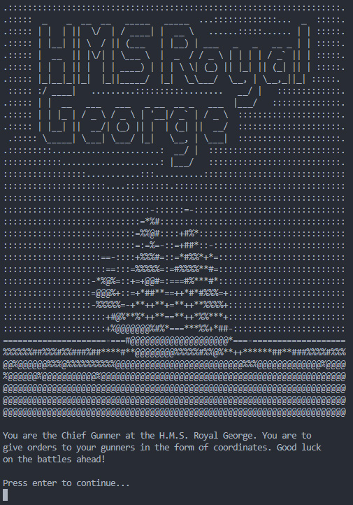

# Royal George

#### Video Demo:

#### Description:

**A little console game concept based on 'Sea Battle' and written in Python**

##### Why?:

As a way of learning Python, I challenged myself learning about using class Methods by making a small game.

##### technical:

Curfew runs with random and os libraries, both being preinstalled with Python 3.

##### Features:

- random generated ship locations
- a forgiving input queue
- A graphic display of the map
- a class based level cycle.
- dynamic updated map depicting hit and miss
- a draw method that rewrites the screen after user input

##### Features that will be nice to have:

- multiple ships in a map
